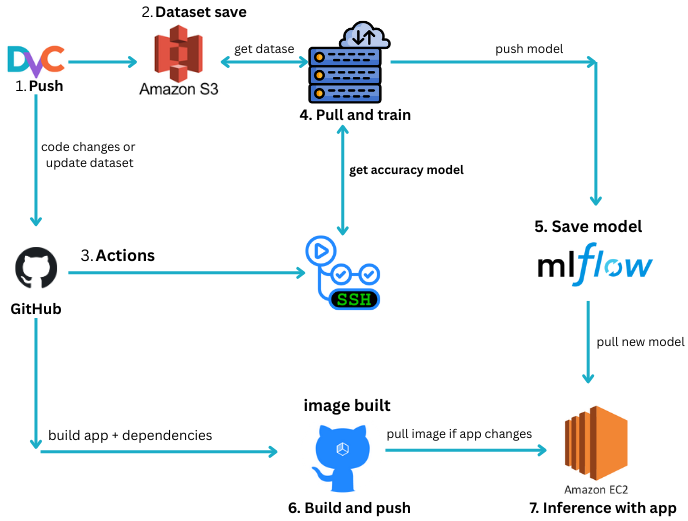

### YOLO Object detection API with CI/CD

The main workflow is:

1. Push code/data → GitHub | using DVC to push new label data to S3
2. GitHub Actions → SSH Training Server
3. Server: dvc pull + train + mlflow log
4. Server: Register model to MLflow
5. Auto-promote a new model if better than production
6. Upload to S3
7. Application rebuild to using the latest model

Dataset (for demo):
https://public.roboflow.com/object-detection/hard-hat-workers

Feature:
* FastAPI Backend
* YOLO model: YOLO11 for realtime object detection
* Docker
* CICD Pipeline: Complete actions workflow
* Automated Testing: Unit test with pytest
* Health Check: Built-in monitoring endpoint

API Endpoints:
* GET / - Root endpoint with API information
* GET /health - Health check endpoint
* GET /model-info - Get model information and available classes
* POST /predict - Upload image and get object detection results

**Training process:**
1. if s3_bucket + model exist => download model + fine-tune from it 
2. Otherwise: fallback to pretrained weight

Project structure:
```
├── app/
│   ├── __init__.py
│   └── main.py              # FastAPI application
├── tests/
│   ├── __init__.py
│   └── test_main.py         # Unit tests
├── .github/
│   └── workflows/
│       └── ci-cd.yml        # CI/CD pipeline
├── data/                    # store in s3 and manage by DVC
│   ├── test/                # test
│       └── images       
│       └── labels       
│   └── train/               # train
│       └── images       
│       └── labels       
│   └── valid/               # val 
│       └── images       
│       └── labels
├── Dockerfile               # Container config
├── docker-compose.yml       # Local deployment
├── requirements.txt         # Python dependencies       
└── README.md
```

#### Prerequisite
* Python 3.12.3+ (I'm using)
* Docker & Docker compose

#### Setup
1. **Clone the repository**
   ```bash
   git clone https://github.com/CN-LEON-DX/mlops-object-detection
   cd mlops-object-detection
   ```
2. **Install dependencies**
   ```bash
   conda create -n yolo-fastapi python=3.12.3 -y
   conda activate yolo-fastapi
   pip3 install -r requirements.txt
   ```
3. **Test VALID train yolo model**
   ```bash
   yolo detect train data=data/data.yaml model=yolo11n.pt epochs=3 imgsz=640
   ```
4. **Setup dvc for data versioning with S3**
   ```bash
   pip install dvc[s3]
   dvc --version
   dvc init
   ```
   https://doc.dvc.org/user-guide/data-management/remote-storage/amazon-s3
5. **Upload data to S3/ DVC**
   ```bash
   dvc add data
   git add data.dvc .gitignore
   git commit -m "...."
   dvc push
   ```
6. **Upload data to S3/ DVC**
   ```bash
   dvc add data
   git add data.dvc .gitignore
   git commit -m "...."
   dvc push
   ```
7. **Upload first model to test local API**
   ```bash
   aws s3 cp yolo11n.pt s3:// your_bucket_name /models/hardhat-detector/production/best.pt
   ```
8. **Try api or app with**
   ```bash
   aws s3 cp yolo11n.pt s3:// your_bucket_name /models/hardhat-detector/production/best.pt
   ```
9. **Try api or app with**
   ```bash
   docker compose build
   docker images
   ```